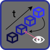

# Raycast Lag Compensation

$~~~~~$

  

# What is Lag Compensation and why do we need it?
Lag Compensation is essential to avoid clients needing to lead their shots in a multiplayer online shooter. I discovered my need for a lag compensation system when creating my own FPS in Unity using Mirror Networking, [Client Side Prediction](https://www.gabrielgambetta.com/client-side-prediction-server-reconciliation.html) and [Snapshot Interpolation](https://gafferongames.com/post/snapshot_interpolation/).\
This also [seems to be needed for Godot](https://github.com/godotengine/godot-proposals/issues/5181).

Explained by gabriel gambetta [here](https://www.gabrielgambetta.com/lag-compensation.html)

Explained by Yahn W. Bernier [here](https://developer.valvesoftware.com/wiki/Latency_Compensating_Methods_in_Client/Server_In-game_Protocol_Design_and_Optimization)

My initial solution is also inspired by [this](https://twoten.dev/lag-compensation-in-unity.html)

Unity Engine version can be found [here](https://github.com/Glitshy/Lag-Compensation)

# What's included
This project contains two systems: 
- My initial approach which functions by setting the transforms of each individual CollisionShape3D of each player to the postion and rotation it was a given time ago (effectively replaced by the third system)
- My second approach with custom collider nodes (sphere, capsule, cylinder and box similar to native Godot's physics CollisionShape3D, as well as a custom mesh shape) and my own raycasting maths called "collider cast"
- My third approach which uses physical collision shapes (like the first approach) but bundles them in collections (like the second approach) and first checks the bounding sphere of the collection before updating the transforms

Two example scenes:
- One for testing the custom hit detection / raycasting maths for all the available shapes, as well as a "collider cast" performance test of the different shapes (spheres perform the best, custom meshes with many trinagles the worst)
- One for comparing the two systems for the purpose of lag compensation and performance.

Code is (somewhat) documented and there is some explanation text in the lag compensation scene.

Uses C# Debug Draw for visualizing colliders https://github.com/Big-Burden/godot-debug-draw

# Why multiple approaches?
Why did I go through the effort of writing my own raycasting system and using custom colliders? 

When moving the transform of a CollisionShape3D and doing a raycast in the same frame, it does not hit at the new position (at least with default physics). This does however work with Jolt Physics. However, moving the transforms has rather poor performance in comparison to a custom solution.
This is a computationally non-trivial task, especially with many colliders (i.e. many players).
There is also an example scene included where the performance of the second/third system can be directly compared.

# How the "NetworkTracker" and the "NetworkTrackerSystem" works (using native godot CollisionShape3D)
The initial approach utilizes nodes of the type "NetworkTracker" to store the position and rotation together with timestamps in a list.
Timestamps should be added at each fixed update together with the server time by the parent node of a player.
The "NetworkTrackerSystem" contains all "NetworkTrackers" in a static list and is used to call the functions to "set the colliders back in time".

Given a certain test time, the postion and rotation at that time is interpolated and the global transforms are set to this interpolated timestamp.
After all colliders have been "sent back in time", Physics.SyncTransforms is called and a normal Raycast is performed.
As the system is designed with non-hitscan projectiles in mind, which travel a certain distance each fixed update, the test time value is incremented in a loop in steps of Time.fixedDeltaTime. At each step, the positions and rotations of the colliders are incremented adn another Racast is performed.
With a lag delay of ~300 ms (extreme example) and a fixed update rate of 50/s, this results in 16 or 17 iterations.

# How "HitCollider" and the "ColliderCastSystem" works (custom colliders)

## "TrackerBase"
Parent class of all HitColliders. Implements timestamps and some shared functions.

## "HitColliderGeneric"
Inherits from the abstract class "TrackerBase". Is itself also an abstract calls from which "HitColliderSphere", "HitColliderCapsule", "HitColliderCylinder", "HitColliderBox" and "HitColliderMesh" inherit.
The transforms of these colliders are never overridden as the custom hit detection code allows passing arbitrary positions and rotations as parameters.

## "HitColliderCollection"
Inherits from the abstract class "HitCollider". Each entity (i.e. player) with one or more "HitColliderGeneric" should have one "HitColliderCollection" at the geometric center. 
A radius value should be set to cover all colliders (keep in mind animations). This radius defines a bounding sphere and allows for quick assessment whether any of the colliders in this collection might be hit by a collider cast.

## "ColliderCastSystem"
Static class containing a static list of all "HitColliderCollection" nodes and the functions to simulate the postions and rotations at a given point in time and perform a collider cast.
When calling the <code>Simulate(double simulationTime)</code> function, at first only the positions and rotations of the collection nodes will be interpolated. The interpolation logic of each individual collider will only be performed if the bounding sphere of the collection intersects with a collider cast.

# How the "HybridTracker" and the "HybridTrackerSystem" works (using native godot CollisionShape3D + bounding sphere checks)

## "TrackerBase"
Parent class of all HybridTrackers. Implements timestamps and some shared functions.

## "HybridTracker"
Allows storing the position and rotation of a target node, typically a CollisionShape3D, and moving the transform with interpolation to it's position and rotation in the past.

## "HybridTrackerCollection"
Inherits from the abstract class "TrackerBase". Each entity (i.e. player) with one or more "HybridTracker" should have one "HybridTrackerCollection" at the geometric center. 
A radius value should be set to cover all colliders (keep in mind animations). This radius defines a bounding sphere and allows for quick assessment whether any of the colliders in this collection might be hit by a raycast.

## "HybridTrackerSystem"
Static class containing a static list of all "HybridTrackerCollection" nodes and the functions to move the postions and rotations of all HybridTrackerCollections to those of given point in time and perform a raycast.
When calling the <code>SimulateStart()</code> function with the desired simulation time, at first only the positions and rotations of the collection nodes will be interpolated. 
Then, <code>RaycastPrepare()</code> is called to check which collections intersect the desired raycast. The interpolation logic of each individual child node will be performed if the collection is hit. Theoretically bounding sphere checking could be performed for each child node, which is currently being skipped.
Following that, a normal raycast can be performed.
Lastly, <code>SimulateReset()</code> resets the transforms.

# Performance Comparison

In my testing, the custom "parametric" raycasts not using the physics engine seem to perform better, especially due to no need to move the transforms of nodes when doing lag compensation. However, the addition of bounding sphere checking made the physics approach using the "HybridTracker" quite viable as well. When I run the lag compensation test scene with the default settings, I receive the following values on my machine (1000 loop iterations):

summedTimeParametric  0.0138s
summedTimePhysicalOptimized 0.327s
summedTimePhysicalSimple 1.75s

Note that the "Physical Simple" approach has very similar performance independent of whether a ray actually hits any colliders or not, while the other two will perform even better when not hit.

~The reason why one might consider the hybrid apporach is  because this supports arbitrarily shaped mesh collision shapes as well, while the custom HitColliders currently only support capsule, box and sphere shapes.~ Update: As of Version 1.1, cylinder and custom mesh shape HitColliders are available.
Also, when raycasting anyways for collision checks with static environment, this apporach also might appear more appealing and the optimized solution includion collection bound sphere checking offers moderate performance.

# Engine Version
Created with Godot Version 4.4, but should work with any newer version but porbably not older 4.X most older versions, as this uses the editor buttons which were introducted in 4.4. Before 4.4, Jolt Physics was not included by default however and is needed for collision shape transform updates to immediately be valid for raycasts.
